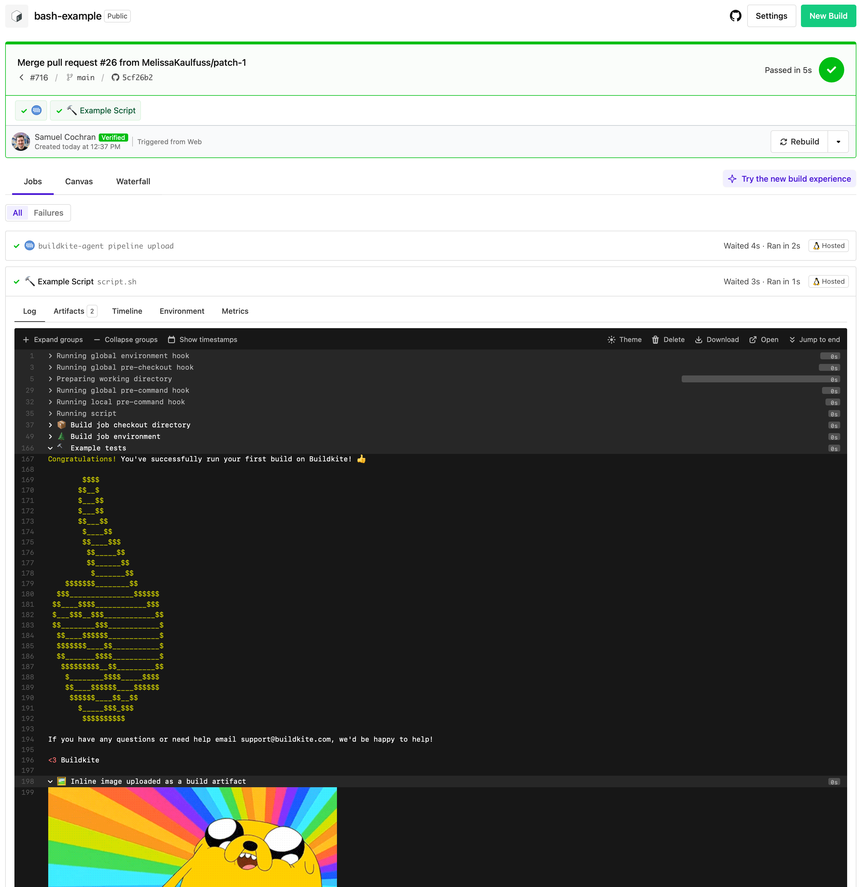

# Buildkite Bash Pipeline Example

This repository is an example [Buildkite](https://buildkite.com/) pipeline for running a simple bash script, [script.sh](script.sh).

The script simply prints some debug output with an inline image, some artifacts, and exits with a success code (0).

See the full [Getting Started Guide](https://buildkite.com/docs/guides/getting-started) for step-by-step instructions on how to get this running, or try it yourself:

## License

See [License.md](License.md) (MIT)
